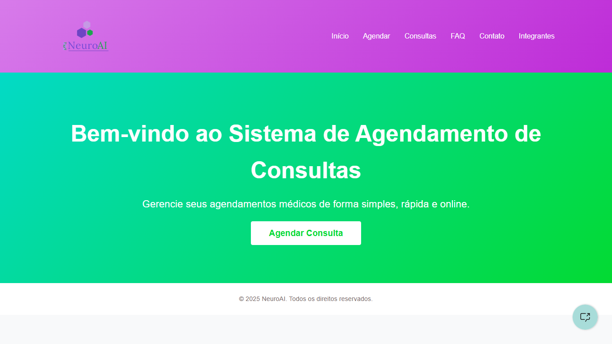
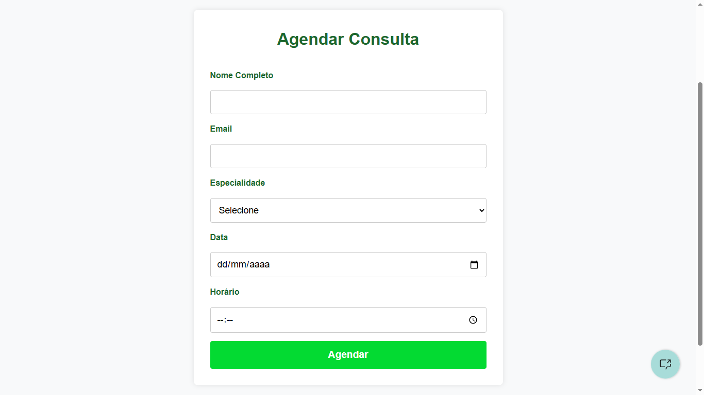
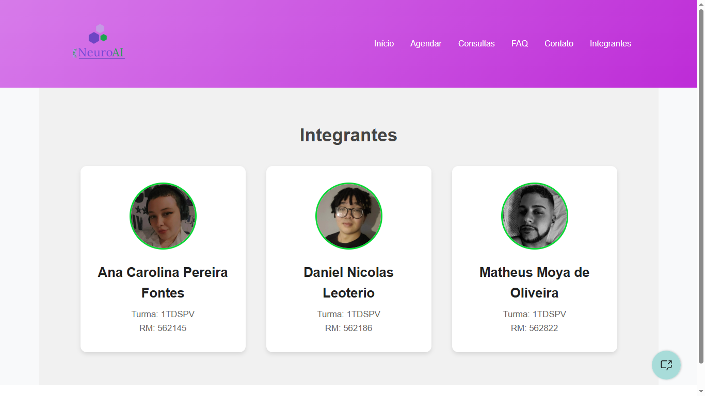

# NeuroAI 

Projeto desenvolvido durante a sprint de FrontEnd da FIAP.

## Funcionalidades

- Agendamento de consultas
- Visualização e exclusão de consultas
- Página de FAQ interativa
- Formulário de contato com validação
- Chatbot integrado com IBM Watson Assistant

## Chatbot

- Integração com o IBM Watson Assistant para oferecer suporte automatizado ao usuário diretamente nas páginas do sistema.

- O chatbot está disponível em todas as páginas, acessível no canto inferior direito da tela.

## Estrutura

- `index.html`: Página inicial
- `agendar-consulta.html`: Agendamento de consultas
- `consultas-marcadas.html`: Consultas agendadas
- `faq.html`: Perguntas frequentes
- `contato.html`: Formulário de contato
- `integrantes.html`: Informações da equipe
- `css/`: Estilos CSS
- `img/`: Imagens e Icones
- `js/`: Scripts JavaScript

## Tecnologias

- HTML5
- CSS3
- JavaScript
- IBM Watson Assistant
- `localStorage` para persistência de dados

## Capturas de Tela

### Página Inicial

### Página de Agendamento

### Página de Integrantes

